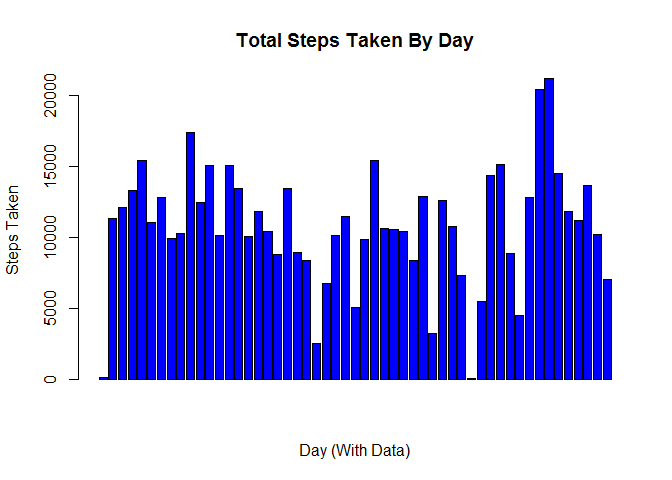
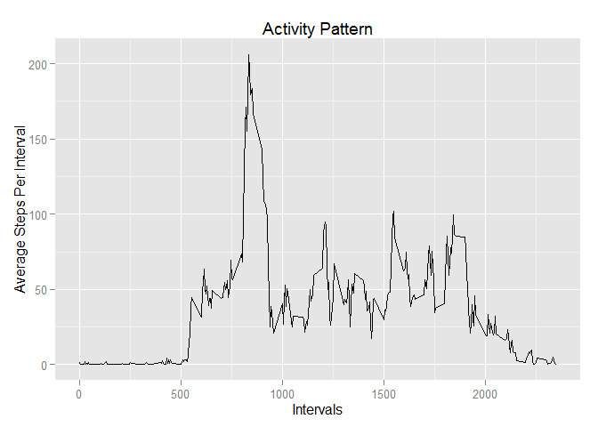
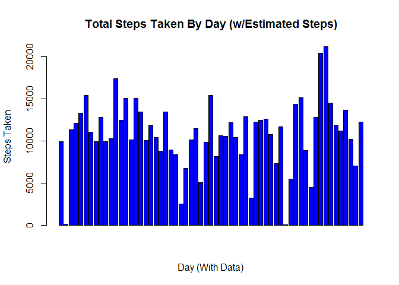
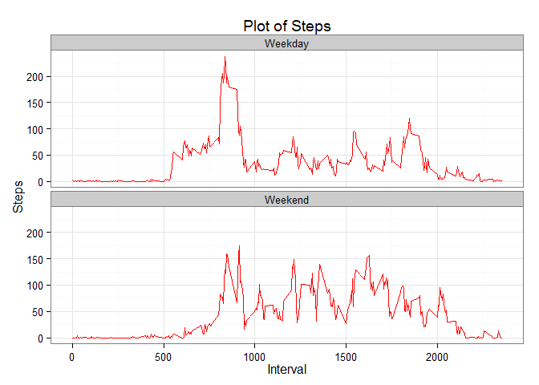

# Reproducible Research: Peer Assessment 1
# <br>Loading and preprocessing the data

<br>Read in the data file.<br><br>


```r
d <- read.csv("activity.csv", sep=",", header=TRUE)
head(d)
```

```
##   steps       date interval
## 1    NA 2012-10-01        0
## 2    NA 2012-10-01        5
## 3    NA 2012-10-01       10
## 4    NA 2012-10-01       15
## 5    NA 2012-10-01       20
## 6    NA 2012-10-01       25
```

## <br>What is mean total number of steps taken per day?
### The following histogram compares the number of steps each day:


```r
x <- subset(d, steps != "NA")
x_sum_by_date <- aggregate(x[, 'steps'], by=list(x$date), sum)
colnames(x_sum_by_date) <- c('Date', 'Steps')

barplot(x_sum_by_date$Steps, xlab="Day (With Data)", ylab="Steps Taken", col = "blue", border = "black",
        main="Total Steps Taken By Day"
)
```

 

```r
### The mean for each day is:
mean(x_sum_by_date$Steps, na.rm = TRUE)
```

```
## [1] 10766.19
```

```r
### The median for each day is:
median(x_sum_by_date$Steps, na.rm = TRUE)
```

```
## [1] 10765
```

## <br>What is the average daily activity pattern?

```r
library(plyr)

mean_by_interval <- ddply(x,~interval, summarize, mean=mean(steps))
head(mean_by_interval)
```

```
##   interval      mean
## 1        0 1.7169811
## 2        5 0.3396226
## 3       10 0.1320755
## 4       15 0.1509434
## 5       20 0.0754717
## 6       25 2.0943396
```
###Time Series Plot

```r
library(ggplot2)

p <- ggplot(mean_by_interval, aes(x=interval, y=mean))
p + geom_line() + ylab('Average Steps Per Interval') + xlab('Intervals') + ggtitle('Activity Pattern') 
```

 
<br><br>
The Five Most Active intervals are:


```r
head(mean_by_interval[order(-mean_by_interval$mean), ], 5)
```

```
##     interval     mean
## 104      835 206.1698
## 105      840 195.9245
## 107      850 183.3962
## 106      845 179.5660
## 103      830 177.3019
```

## <br>Imputing missing values
###Missing Values


```r
library(lubridate)
```

```
## 
## Attaching package: 'lubridate'
## 
## The following object is masked from 'package:plyr':
## 
##     here
```

```r
x_steps_na <- subset(d, is.na(steps))
x_steps_na$wday <- wday(as.Date(x_steps_na$date), label = TRUE)
```

The number of rows with a missing value for steps is:


```r
nrow(x_steps_na)
```

```
## [1] 2304
```

The steps will be imputted by taking the mean of the interval, by the day of the week.<br>
<br>1 Get the name of the day of week
<br>2 Find the mean of the interval and day-of-week
<br>3 Match data, place into x_steps_na
<br>4 Merge x and x_steps_na to get all possible intervals and days-of-week
<br>


```r
x$wday <- paste(wday(as.Date(x$date), label=TRUE))
mean_by_interval_wday <- ddply(x, .(interval, wday), summarize, mean=mean(steps))

x_steps_na <-join(x_steps_na,  mean_by_interval_wday, type="inner") 
```

```
## Joining by: interval, wday
```

```r
x_all <- x
x_steps_na$steps <- x_steps_na$mean

x_all <- rbind(x_all, x_steps_na[,c(1,2,3,4)])

x_sum_by_datex <- aggregate(as.integer(x_all[, 'steps']), by=list(x_all$date), sum)
colnames(x_sum_by_datex) <- c('Date', 'Steps')

barplot(x_sum_by_datex$Steps, xlab="Day (With Data)", ylab="Steps Taken", col = "blue", border = "black",
        main="Total Steps Taken By Day (w/Estimated Steps)"
)
```

 

## The following calculates median and mean, which includes estimated values


```r
### The mean for each day is:
mean(x_sum_by_datex$Steps, na.rm = TRUE)
```

```
## [1] 10809.79
```

```r
### The median for each day is:
median(x_sum_by_datex$Steps, na.rm = TRUE)
```

```
## [1] 11015
```

## <br>Are there differences in activity patterns between weekdays and weekends?
<br>Split x_all into 2 datasets
<br>Get the mean
<br>Add the Weekday or Weekend Label
<br>Put back into dataset - x_wd_avg
<br>Plot the graph


```r
x_weekdays <- subset(x_all, wday != "Sat" & wday != "Sun")
x_weekend  <- subset(x_all, wday == "Sat" | wday == "Sun")

x_wd_avg <- aggregate(steps ~ interval, data=x_weekdays, mean)
x_wd_avg$line <- "Weekday"
w_we_avg <- aggregate(steps ~ interval, data=x_weekend, mean)
w_we_avg$line <- "Weekend"

x_wd_avg <- rbind(x_wd_avg, w_we_avg)

ggplot(x_wd_avg, aes(x=interval, y=steps)) + 
        geom_line(color="red") + 
        facet_wrap(~ line, nrow=2, ncol=1) +
        labs(x="Interval", y="Steps") +
        theme_bw() + ggtitle('Plot of Steps') 
```

 


Note that the `echo = FALSE` parameter was added to the code chunk to prevent printing of the R code that generated the plot.
